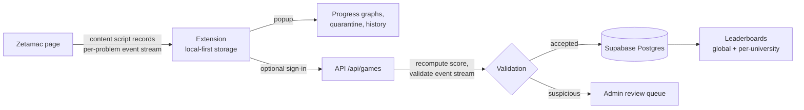

<p align="center">
  
</p>

<h1 align="center">ZetaLog</h1>

<p align="center">
  Frictionless score tracking and a UK-university leaderboard for
  <a href="https://arithmetic.zetamac.com/">Zetamac</a>, the mental-maths speed drill.
</p>

---

ZetaLog is two things:

- **A browser extension** that sits in the background and records every Zetamac game you
  play — no buttons, no setup. It shows your progress over time, quarantines obvious
  restarts and outliers (restorable, never silently deleted), and works fully offline with
  no account.
- **An opt-in leaderboard** ranking verified personal bests at 30s / 60s / 120s on the
  default Zetamac configuration — globally and per UK university, with badges earned by
  verifying a university email address.

## How it works



Scores are never self-reported: the extension submits the full per-problem event stream
(problem text, keystroke timings, answer moments) and the server **recomputes the score**,
then applies physiological plausibility rules (human answer-rate floors, keystroke-cadence
uniformity checks), consistency rules, and per-user statistical history checks before a
game may rank. Suspicious submissions land in a human review queue.

## Repository

| Path                      | Contents                                                                                                             |
| ------------------------- | -------------------------------------------------------------------------------------------------------------------- |
| `packages/shared`         | Pure, exhaustively tested domain logic: types, design tokens, settings fingerprinting, quarantine + validation rules |
| `apps/extension`          | WXT extension (Chrome-family, Manifest V3)                                                                           |
| `apps/web`                | Next.js site on Vercel: leaderboards, personal dashboard, API, admin                                                 |
| `supabase/`               | Postgres migrations, RLS policies, UK-university seed data                                                           |
| `docs/superpowers/specs/` | The design spec (source of truth)                                                                                    |

## Engineering standards

This project is built to be read. In brief:

- **Strict TypeScript** (`noUncheckedIndexedAccess`, `exactOptionalPropertyTypes`), zero-warning
  type-aware linting, and `pnpm verify` (format → lint → typecheck → test → build) green on
  every commit.
- **Pure domain core:** all scoring and anti-abuse logic is deterministic, dependency-injected,
  and property-tested; `packages/shared` enforces 100% branch coverage in CI.
- **Errors as values, zod at every boundary,** and RLS-default-deny with service-role writes
  confined to the server.

The full bar is specified in the design spec, §11.

## Development

```sh
pnpm install
pnpm verify        # format, lint, typecheck, test, build — the same gate CI runs
```

Copy `.env.example` and fill in Supabase + Resend credentials for the web app
(the extension needs no secrets).

## Status

In active development. The design spec is complete
(`docs/superpowers/specs/2026-07-20-zetalog-design.md`); implementation follows the phased
plan in `docs/superpowers/plans/`.
