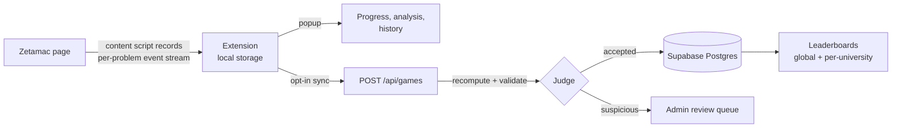

<p align="center">
  
</p>

<h1 align="center">ZetaLog</h1>

<p align="center">
  A score tracker and worldwide leaderboard for
  <a href="https://arithmetic.zetamac.com/">Zetamac</a>, the mental-arithmetic
  game used to build speed for quant interviews.
</p>

<p align="center">
  <a href="https://www.zetalog.co.uk">zetalog.co.uk</a>
</p>

---

ZetaLog has two parts:

- **A Chrome extension** that records every Zetamac game you play, with no setup and
  no account. It charts your progress, keeps a personal-best per duration, and works
  fully offline. Restarts and outliers are flagged for review rather than silently
  dropped. Removed games are retained with an active account for history and audit;
  a confirmed account-deletion request immediately deletes the account and its
  associated data, apart from an anonymous security event retained for at most 30 days.
- **A web leaderboard** that ranks checked personal bests at 30s, 60s and 120s on the
  default Zetamac settings, globally and per UK university, with a badge earned by
  verifying a university email.

Scores are never taken on trust. The extension submits the full per-problem event
stream (problem text, keystroke timings, answer moments) and the server **recomputes
the score** from it, then runs physiological, consistency and per-user statistical
checks before a game is allowed to rank. Anything suspicious lands in a review queue.

## Architecture


```mermaid
flowchart LR
    Z[Zetamac page] -->|content script records\nper-problem event stream| E[Extension\nlocal storage]
    E -->|popup| G[Progress, analysis,\nhistory]
    E -->|opt-in sync| A[POST /api/games]
    A -->|recompute + validate| V{Judge}
    V -->|accepted| D[(Supabase Postgres)]
    V -->|suspicious| Q[Admin review queue]
    D --> L[Leaderboards\nglobal + per-university]
```

| Path              | Contents                                                                            |
| ----------------- | ----------------------------------------------------------------------------------- |
| `packages/shared` | Pure domain logic: schemas, design tokens, score recomputation, validation pipeline |
| `apps/extension`  | WXT extension (Chrome, Manifest V3): recorder, popup, background sync               |
| `apps/web`        | Next.js app on Vercel: leaderboards, dashboard, API routes, admin                   |
| `supabase/`       | Postgres migrations, RLS policies, retention job, UK-university seed data           |
| `docs/`           | Operational runbooks and Chrome Web Store listing                                   |

## Design

The domain core is deterministic and dependency-free: scoring, validation and
anti-abuse rules are pure functions in `packages/shared`, with clocks and randomness
injected rather than read. Both the extension (client-side pre-flagging) and the
server (authoritative judging) run the same code, so a score is evaluated identically
wherever it is checked.

The server is the only writer. All game writes go through the API with the Supabase
service role; row-level security is default-deny and the service-role key never
reaches a client bundle. Every external boundary (DOM, network, storage) is validated
with [zod](https://zod.dev) schemas, and errors are returned as typed values rather
than thrown.

Extension linking uses Chrome Identity with PKCE. Chrome 116 or later is required.
One explicit Link click opens the browser-owned authorization flow; the extension
keeps its PKCE verifier and exchanges the returned code for an installation credential.
Website access or refresh tokens never pass to the extension. A healthy legacy link
migrates silently; only a legacy link that has already failed needs the user to relink.
See `docs/store/CHROMEWEBSTORE.md` for the required Chrome Web Store ID and deployment
order.

## Development

```sh
pnpm install
pnpm verify        # format, lint, typecheck, test, build — the gate CI runs
```

`pnpm verify` must pass before every commit. Protected CI also starts a fresh
Supabase stack, runs pgTAP and full-stack E2E, then browser-tests the exact retained
release ZIP. See [CONTRIBUTING.md](CONTRIBUTING.md) for the engineering bar and
[`docs/ops/release-readiness.md`](docs/ops/release-readiness.md) for the release gates.

Copy `.env.example` to `.env.local` and fill in the Supabase and Resend credentials
for the web app. Before enabling extension linking, set the server-only
`EXTENSION_OAUTH_REDIRECT_URIS` to the exact Chrome Identity callback for the
official extension ID (`https://<extension-id>.chromiumapp.org/zetalog-link`).
The extension needs no secrets.

## Tests

More than 900 unit tests across the workspace, plus Playwright end-to-end runs for the
extension and the web app. `packages/shared` holds 100% branch coverage, enforced in
CI. Database policies are covered by pgTAP.

## Licenses

The bundled fonts are licensed under the SIL Open Font License 1.1; see
[THIRD-PARTY-LICENSES.md](THIRD-PARTY-LICENSES.md).
