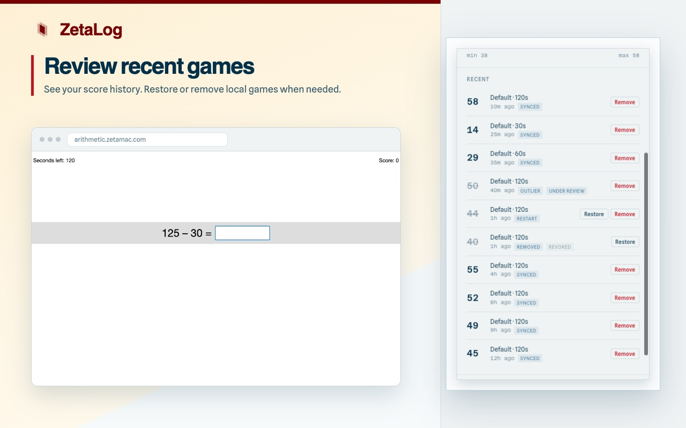

<p align="center"></p>

# ZetaLog

A Chrome extension and website for tracking [Zetamac](https://arithmetic.zetamac.com/) mental-arithmetic practice. The extension records games offline and shows score history. Linked accounts can sync games to personal dashboards and global or university leaderboards.

[Website](https://www.zetalog.co.uk) · [Chrome extension](https://chromewebstore.google.com/detail/zetalog/bjleafpcpockiiblhkoddgomhkloaiab)



## From recorded game to ranked score

The server does not rank a game from its claimed score alone. The extension records displayed problems, inputs and acceptance events. A shared TypeScript implementation solves each problem again and counts verified answers.

| Component                                                    | What it handles                                                                                                 |
| ------------------------------------------------------------ | --------------------------------------------------------------------------------------------------------------- |
| [Score replay](packages/shared/src/score.ts)                 | Pairs problems with answers and recomputes the score from the event stream.                                     |
| [Game validation](packages/shared/src/validation/verdict.ts) | Checks timestamps, problem ranges, event consistency and unusual input patterns. Suspicious games enter review. |
| [Submission service](apps/web/lib/games/submit.ts)           | Separates validation from storage through an injected data-access interface.                                    |
| [Database adapter](apps/web/lib/games/port.ts)               | Deduplicates uploads and checks quotas in one SQL operation, including concurrent retries.                      |

The extension works before sign-in, so synchronisation handles old recordings, unreliable clocks and repeated requests. Database receipt times drive quotas. Local play times remain available for personal history.

Account linking uses Chrome Identity with an S256 PKCE challenge. The extension receives a revocable credential rather than the website's refresh token. Credential secrets are stored as hashes on the server. Linking requires Chrome 116 or later.

Leaderboards support 30, 60 and 120-second games on default settings. University email verification adds a badge. Admin review and account erasure are also implemented.

## Run locally

Use **Node.js 24+** and **pnpm 10.30.3**, as declared in `package.json`.

```sh
pnpm install --frozen-lockfile
pnpm verify
```

The verification build does not need production secrets. For a connected local web
app, create its environment file in the app directory:

```sh
cp .env.example apps/web/.env.local
pnpm --filter @zetalog/web dev
```

Set the Supabase URL, anonymous key and server-only service-role key in that file.
Apply the migrations to a local Supabase instance or a separate development
project, seed universities and configure authentication/email before testing
account flows. The exact callback allowlist is documented in
[Chrome Web Store setup](docs/store/CHROMEWEBSTORE.md). The extension needs no secrets.

For extension development:

```sh
pnpm --filter @zetalog/extension dev
# Or produce a loadable Chromium build:
pnpm --filter @zetalog/extension build
```

Load `apps/extension/.output/chrome-mv3` as an unpacked extension at
`chrome://extensions`, then play on Zetamac. Development linking requires the
callback for that extension ID to be explicitly permitted; recording works signed out.

## Verification

`pnpm verify` checks formatting, lint, types and tests before building both applications. The shared package requires full statement, function, line and branch coverage. Separate suites exercise authentication, recording, retries and storage.

```sh
pnpm test:release-tooling
pnpm --filter @zetalog/extension exec playwright test e2e/extension.spec.ts e2e/link.spec.ts
```

CI also starts a fresh database stack, applies migrations and runs database and browser tests. These require Docker and installed Playwright browsers. The [release checklist](docs/ops/release-readiness.md) covers extension packaging and connected account flows.

## Limits

Score replay establishes consistency with the submitted events. It cannot prove a person played the game because the player controls the browser and its telemetry. Fabricated streams may pass the heuristics and legitimate games may need review. Server-issued start challenges add evidence for online games while offline submissions remain supported.

[Contribution guide](CONTRIBUTING.md) · [Security reporting](SECURITY.md) · [Third-party licences](THIRD-PARTY-LICENSES.md)
