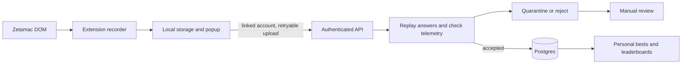

<p align="center"></p>

# ZetaLog

ZetaLog records [Zetamac](https://arithmetic.zetamac.com/) mental-arithmetic games,
shows how a player's speed changes over time and maintains global and university
leaderboards. The Chrome extension works without an account or a network connection.
Players can later link an account and submit their recorded games for server-side
validation.

[Website](https://www.zetalog.co.uk) ·
[Chrome extension](https://chromewebstore.google.com/detail/zetalog/bjleafpcpockiiblhkoddgomhkloaiab)

The interesting engineering problem is the boundary between **offline ownership of
personal data** and **a shared ranking that cannot trust a client-supplied score**.
The extension records an event stream; the server replays it, checks its consistency
and decides whether it can rank. Authentication, retries, moderation and account
removal all have to preserve that distinction.


## What is built

- A Manifest V3 extension with automatic recording, local game history, progress
  analysis and personal bests. Restarts and suspicious games remain reviewable.
- A Next.js website with personal dashboards and leaderboards at 30, 60 and 120
  seconds on default Zetamac settings. University-email verification adds a badge;
  university boards cover the seeded UK and US institutions.
- Account linking through Chrome Identity and PKCE, revocable installation
  credentials, opt-in synchronization, an admin review queue and account erasure.
- A shared TypeScript domain package, Supabase migrations and database tests,
  browser tests and release-artifact checks.

## From a game to a leaderboard entry


```mermaid
flowchart LR
    Z[Zetamac DOM] --> R[Extension recorder]
    R --> L[Local storage and popup]
    L -->|linked account, retryable upload| A[Authenticated API]
    A --> S[Replay answers and check telemetry]
    S --> Q[Quarantine or reject]
    S -->|accepted| D[(Postgres)]
    D --> B[Personal bests and leaderboards]
    Q --> M[Manual review]
```

[`recomputeScore`](packages/shared/src/score.ts) pairs displayed arithmetic problems
with inputs and acceptance events. It solves each problem independently and counts
only verified answers. The claimed page score is retained for comparison, but
`server_score` is the ranking value.

[`judge`](packages/shared/src/validation/verdict.ts) combines four kinds of evidence:

| Check                                          | Purpose                                                                            | Decision               |
| ---------------------------------------------- | ---------------------------------------------------------------------------------- | ---------------------- |
| Timeline and allowed problem ranges            | Detect inconsistent timestamps, excessive duration and impossible generator output | Reject hard violations |
| Event-stream integrity                         | Detect orphan acceptances and mismatched answers                                   | Quarantine for review  |
| Timing, input cadence and problem distribution | Flag implausible speed, pasted inputs, uniform cadence and unusual problem samples | Quarantine for review  |
| Accepted-score history                         | Flag an unusually large personal-best jump                                         | Quarantine for review  |

A claimed-score mismatch alone does not invalidate the independently recomputed
score. An event anomaly does require review: a recorder defect and fabricated
telemetry can look similar, so preserving the evidence is more useful than
silently discarding it.

These checks **do not prove that a human played a game**. The browser and its
telemetry remain under the player's control. Plausible fabricated streams can evade
heuristics and exceptional legitimate games can be flagged. The thresholds are
engineering rules, not a published classifier with measured false-positive rates.
Server-issued start challenges add online evidence; offline submissions remain
supported, so the system cannot require trusted online timing for every game.

## Design decisions

**One replay implementation.** Scoring and validation live in
[`packages/shared`](packages/shared/src). The functions take explicit inputs and
history, making their decisions reproducible in both the extension and API. Pure
logic is easier to exercise exhaustively than scoring embedded in a DOM handler.
Capture, storage and database access stay outside that core.

**Retryable writes with a database boundary.** The submission pipeline uses an
injected [`SubmitPort`](apps/web/lib/games/submit.ts). The
[Supabase adapter](apps/web/lib/games/port.ts) passes the validated record to an atomic
SQL operation that handles `(user_id, client_game_id)` deduplication and quota
checking together. A retry returns the existing result, including a game the user
subsequently removed. An application-only quota check would race between concurrent
requests; the preliminary check here is an optimization, not the final authority.

**The API owns privileged writes.** Supabase's service role is server-only. API
handlers authenticate the user, scope reads and writes to that identity and validate
request bodies. RLS and explicit database grants constrain direct client access;
they do not replace authorization inside code using the service role. Database
errors can throw at adapters and are handled at the HTTP boundary.

**Extension credentials are separate from website sessions.** Linking uses an exact
Chrome Identity callback and an S256 PKCE challenge. A short-lived authorization
code is exchanged for a revocable extension credential. Website refresh tokens are
not copied into the extension; high-entropy credential secrets are stored as hashes
server-side. Chrome 116 or later is required for the linking flow.

**Local-first is a deliberate cost.** Games can be recorded before sign-in and
backfilled later, but synchronization must tolerate duplicate requests, old client
clocks and intermittent connectivity. Client play times are display data; database
receive times drive submission quotas. Personal analytics and public ranking are
separate concerns.

## Run locally

Use **Node.js 24+** and **pnpm 10.30.3**, as declared in `package.json`.

```sh
pnpm install --frozen-lockfile
pnpm verify
```

The verification build does not need production secrets. For a connected local web
app, create its environment file in the app directory:

```sh
cp .env.example apps/web/.env.local
pnpm --filter @zetalog/web dev
```

Set the Supabase URL, anonymous key and server-only service-role key in that file.
Apply the migrations to a local Supabase instance or a separate development
project, seed universities and configure authentication/email before testing
account flows. The exact callback allowlist is documented in
[Chrome Web Store setup](docs/store/CHROMEWEBSTORE.md). The extension needs no secrets.

For extension development:

```sh
pnpm --filter @zetalog/extension dev
# Or produce a loadable Chromium build:
pnpm --filter @zetalog/extension build
```

Load `apps/extension/.output/chrome-mv3` as an unpacked extension at
`chrome://extensions`, then play on Zetamac. Development linking requires the
callback for that extension ID to be explicitly permitted; recording works signed out.

## Verification and scope

`pnpm verify` runs formatting, lint, TypeScript checks, tests and both application
builds. The shared package enforces 100% statement, function, line and branch
coverage; that measures exercised paths, not resistance to all possible cheating.
The web and extension have their own suites for authentication, linking, retries,
storage and UI behavior.

```sh
pnpm test:release-tooling
pnpm --filter @zetalog/extension exec playwright test e2e/extension.spec.ts e2e/link.spec.ts
```

CI additionally starts a fresh Supabase stack, applies migrations, runs pgTAP and
full-stack browser checks and inspects the retained extension ZIP. These require
Docker and installed Playwright browsers. See the
[release checklist](docs/ops/release-readiness.md) for the difference between a
passing local build and a verified release.

This repository demonstrates capture and synchronization reliability, explicit
trust boundaries and testable domain logic. It does not establish that arithmetic
practice predicts interview performance or that every accepted score is genuine.
The September 2026 review tightened anomaly quarantine and clarified those limits;
it did not retroactively relabel existing games.

[Contribution guide](CONTRIBUTING.md) · [Security reporting](SECURITY.md) ·
[Third-party asset and font licenses](THIRD-PARTY-LICENSES.md)
